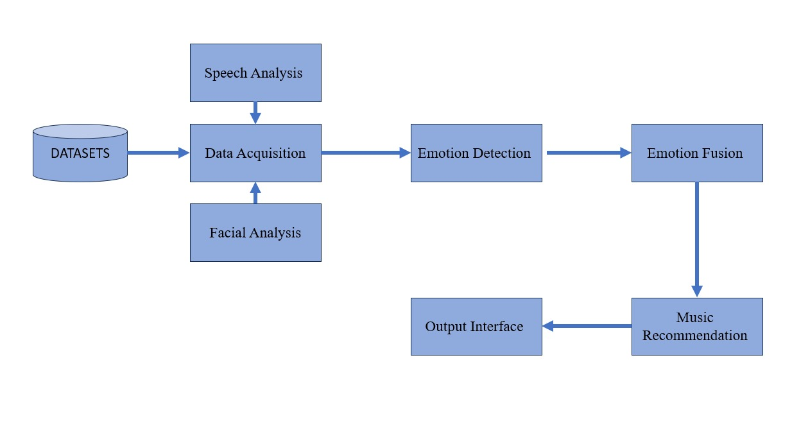
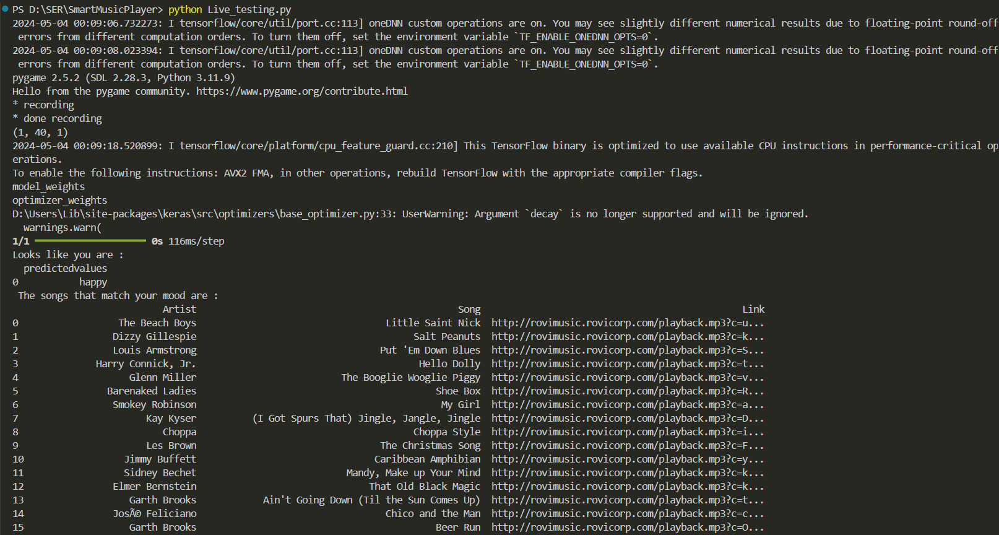

### Part-1 : Speech emotion recognition
We use speech to determine the emotion of a user. We make use of the vocal characteristics of the user for the task without considering the semantics. This makes it a text independent method of speech recognition. The aim of this project was to create a smart music player based on the emotion of the user that not only recommends, but creates music fit for that particular emotion. 
The building blocks of the module consists of identifying the emotion of a given user and recommending songs which mirror the mood of the user, meanwhile suggesting the songs that the user should listen to improve the mood. This takes a live audio sample of the user as input and processes it to predict the emotion. The emotion is mapped to a few related songs which is displayed in the console for the user to choose from.

### Dataset used for Music Recommendation module 
 
The Ryerson Audio-Visual Database of Emotional Speech and Song (RAVDESS) was used as our dataset to train the classification model for emotion recognition. It consists of around 1500 files with 24 actors (12 male + 12 female) speaking with 8 different emotions. However, we have considered only 5 of those emotions - happy, sad, calm, angry and neutral. We also used a list of 900 songs with emotion tags for all the five emotions used in our project to recommend songs to the user fitting his/her mood.

