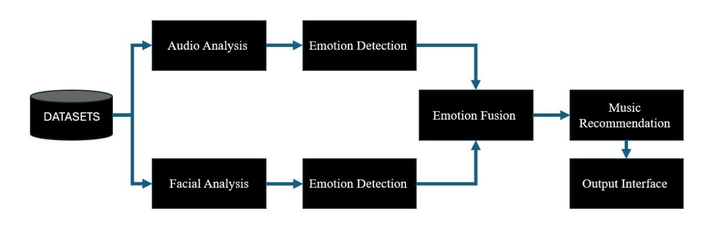
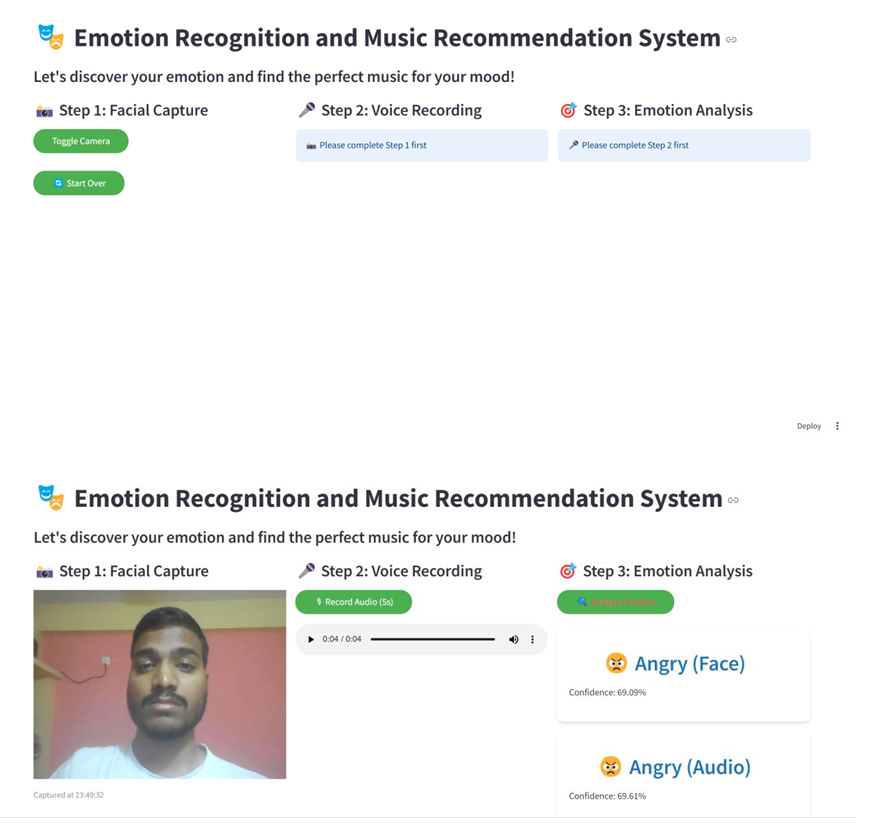
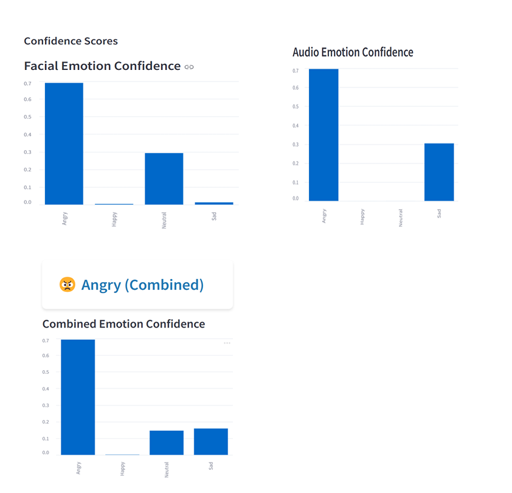
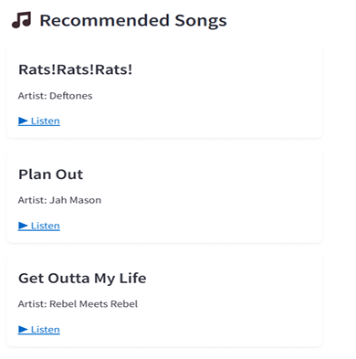
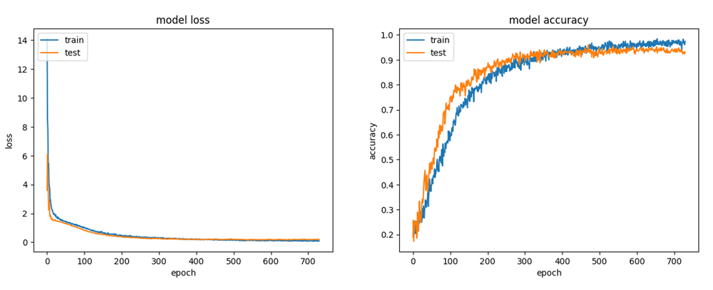
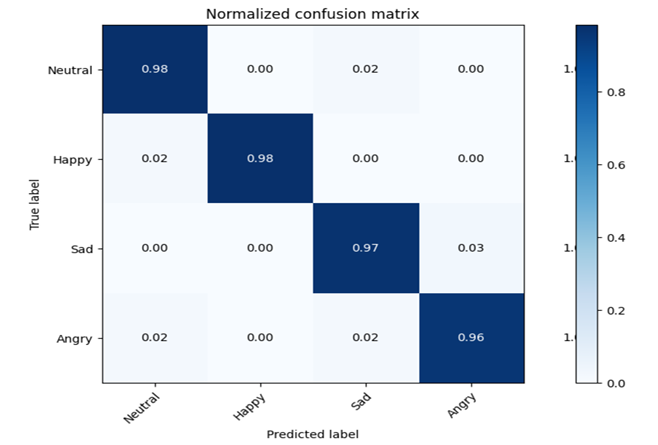
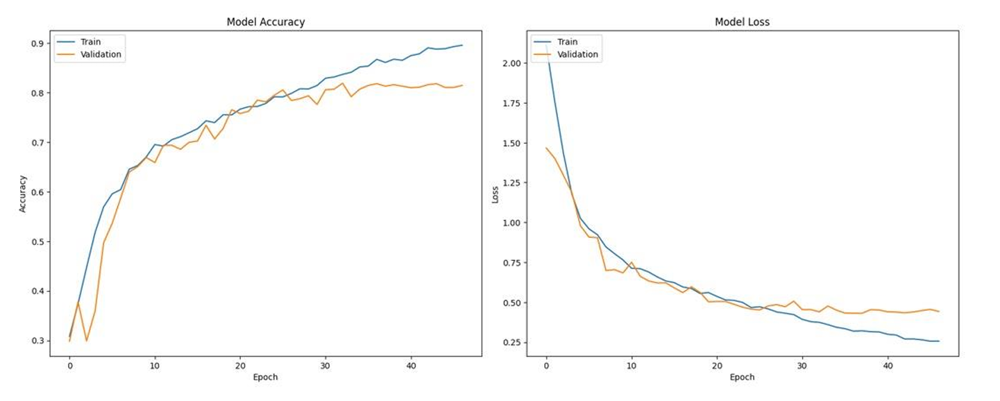
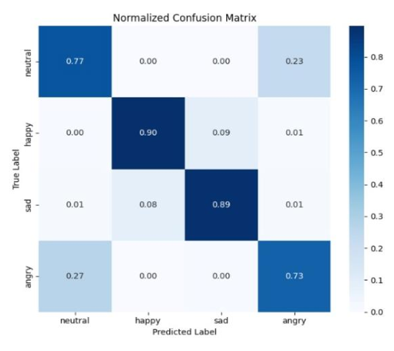

# 🎵 Emotion-Based Music Recommendation System 🎵

This project combines **Audio Emotion Analysis** and **Facial Emotion Recognition** to create a smart music recommendation system that adapts to users' emotions. The system leverages cutting-edge **multi-modal AI** techniques, offering personalized music suggestions to reflect or improve the user's mood. 

## 🌟 Key Features
1. **Speech Emotion Recognition**: Analyzes vocal characteristics to predict the user's emotion without considering semantics, ensuring a text-independent process.
2. **Facial Emotion Recognition**: Utilizes a deep learning model to identify emotions from user-provided facial images.
3. **Emotion Fusion**: Combines insights from both speech and facial analysis for robust emotion prediction.
4. **Music Recommendation**: Suggests emotion-specific songs from a curated dataset, helping users enhance or balance their mood.
5. **Interactive UI**: Offers an intuitive user interface to input emotions and explore recommended songs.


## 🔧 Architecture Overview




The workflow begins with collecting user inputs (facial image and speech audio). These inputs are processed through separate pipelines for **facial** and **audio emotion analysis**. The results are fused to finalize the emotion label, which maps to a curated music dataset, presenting personalized song recommendations.

## 📊 Datasets

### 1. **Speech Emotion Recognition**
- **Dataset**: [RAVDESS](https://zenodo.org/record/1188976) - The Ryerson Audio-Visual Database of Emotional Speech and Song.
- **Details**: 
  - 1500 audio samples from 24 actors (12 male, 12 female).
  - Used 5 emotions: *Happy, Sad, Calm, Angry, Neutral*.
- **Processing**: Extracted **MFCC features** to train a CNN for audio emotion recognition.

### 2. **Facial Emotion Recognition**
- **Datasets**: Merged [AffectNet](http://www.affective-db.org/) and [FER2013](https://www.kaggle.com/c/challenges-in-representation-learning-facial-expression-recognition-challenge).
- **Preprocessing**:
  - Retained key emotions (*Happy, Sad, Neutral, Angry*).
  - Resized images to **48x48**, converted to grayscale, and applied class balancing with data augmentation.

### 3. **Music Recommendation**
- **Dataset**: A custom list of 900 songs tagged with emotions, mapped to the five core emotions identified in the project.


## 🚀 Key Achievements

1. **Audio Emotion Analysis**:
   - Achieved **98.33% training accuracy** and **96.91% validation accuracy** using CNN models with MFCC features.
2. **Facial Emotion Recognition**:
   - Combined AffectNet and FER2013 datasets to achieve **81.85% training accuracy** and **86.08% validation accuracy** with a custom CNN model.
3. **Emotion Fusion**:
   - Implemented a Random Forest Classifier for feature-level fusion, significantly improving prediction accuracy.
4. **Real-Time Testing**:
   - Enabled live emotion detection from speech and facial inputs, ensuring system responsiveness and adaptability.

## 🎨 UI Design

The system features a user interface built with streamlit, designed for simplicity and visual appeal. Users can:
- Upload a facial image and provide a speech audio input.
- View real-time predictions and corresponding music recommendations.
### Final UI Look:
<div style="display: flex; justify-content: space-between; align-items: center; gap: 10px;">
    
    
    
</div>


## 📈 Individual Model Results

### **Audio Emotion Analysis**
- **Train Accuracy**: 98.33%  
  Demonstrates the model's robust ability to generalize and predict emotions accurately from audio inputs.
- **Validation Accuracy**: 96.91%  
  Indicates strong model performance on unseen validation data. Gaps between train and validation accuracy were monitored to minimize overfitting or underfitting.

#### Train and Validation Accuracy Plot:
<div style="display: flex; justify-content: space-around; align-items: center;">
    
    
</div>


### **Facial Emotion Recognition**
- **Train Accuracy**: 81.85%  
  Highlights the model's capability to correctly identify facial expressions linked to emotions.
- **Validation Accuracy**: 86.08%  
  Demonstrates excellent performance on unseen validation data.

#### Train and Validation Accuracy Plot:
<div style="display: flex; justify-content: space-around; align-items: center;">
    
    
</div>


## 🛠️ Methodology

### Facial Emotion Recognition:
1. **Data Preprocessing**:
   - Resized images to 48x48 pixels.
   - Applied grayscale conversion for consistent input format.
   - Balanced classes using augmentation techniques.

2. **Model Training**:
   - Custom CNN model optimized for AffectNet + FER2013.
   - Regularization and dropout to avoid overfitting.

### Speech Emotion Recognition:
1. **Feature Extraction**:
   - Extracted **MFCC features** for speech signals.
   - Enhanced noise handling for real-world robustness.
2. **Model Training**:
   - CNN architecture fine-tuned for RAVDESS dataset.

### Emotion Fusion:
- Employed dynamic confidence-based weighting to integrate facial and speech emotion results, ensuring higher trust in the model with greater prediction confidence.


## 📈 Results and Impact

- **Fusion Benefits**: Combining audio and visual inputs improved emotion prediction accuracy, highlighting the potential of multi-modal AI.
- **Real-World Applications**:
  - Adaptive music recomendation.
  - Emotion-sensitive AI systems for mental health.


## 💻 Setup Instructions

1. Clone the repository:
   ```bash
   git clone https://github.com/your-repo-name.git
   cd EmotionBasedMusicSystem

2. Install dependencies:
   ```bash
   pip install -r requirements.txt

3. Run the application:
   ```bash
   python main.py
4. Access the UI: Open http://127.0.0.1:5000 in your browser.

## 🎯 Future Enhancements
1. Expanding to additional emotion categories.
2. Integrating real-time song generation based on emotions.
3. Deploying the system on AWS for scalability and accessibility.

## Contributing
Contributions are welcome! To contribute to this project, please follow these steps:

1. **Fork the Repository**:
    ```bash
    git clone https://github.com/yourusername/bigram-transformer-model.git
    cd bigram-transformer-model
    ```

2. **Create a New Branch**:
    ```bash
    git checkout -b feature-or-bugfix-name
    ```

3. **Make Your Changes and Commit**:
    ```bash
    git commit -am 'Add new feature or fix'
    ```

4. **Push Your Branch**:
    ```bash
    git push origin feature-or-bugfix-name
    ```

5. **Create a Pull Request**:
    - Go to the repository on GitHub.
    - Click on "New Pull Request."
    - Describe your changes and submit the PR.
## Future Work:
Recommendation Dataset: Lets make it tuned for some latest dataset like spotify.
Add more personalisation features in the GUI  and Experiment with different hyperparameters to further improve both the models performance for more genralised predictions. 


## Contact
For questions or suggestions, please open an issue or contact [Vvslaxman](mailto:vvslaxman14@gmail.com).
